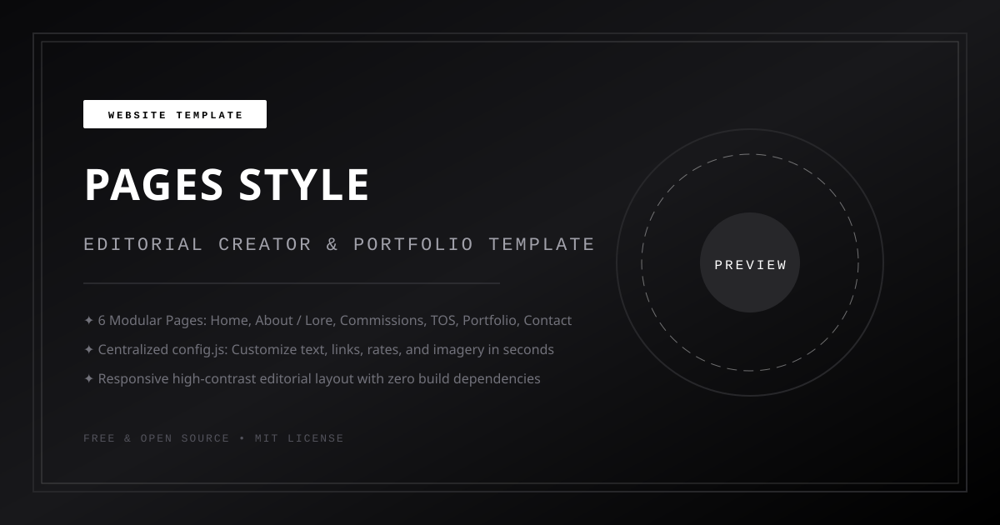

# Pages Style — Editorial Creator Portfolio Template



A clean, open-source editorial creator portfolio and commission guide skeleton template inspired by iconic minimalist Carrd aesthetics. Designed for digital illustrators, VTubers, animators, streamers, and creative designers.

Styled with an animated twinkling starfield background, flat pure-white canvas (`border-radius: 0`), crisp typography pairing Google Fonts (`Tajawal` and `Shrikhand`), inline text navigation with right-aligned icons, signature diagonal hatched dividers (`////////////////`), 16:9 media embed, and a floating footer credit.

If you use this template, please keep the small credit in the footer linking back to the repository.

---

## What is Included

- **6 Modular Sections in One Page:**
  1. **Header:** Top-right update date, cute mascot silhouette logo, bold italicized creator title, tagline, and borderless inline text navigation links with right-aligned icons.
  2. **Home:** 2-column layout with 16:9 media embed (YouTube or custom video) + project credits caption on left, and introduction bio + status news updates with bullet arrows (`›`) on right.
  3. **Lore & About:** Origin narrative, creative milestones timeline, community marks/hashtags table, and character portrait display frame.
  4. **Commissions:** Tiered commission blocks (Live2D Model Art, Full Illustration, Character Design, GFX Stream Assets) with status pills, price tags, and resolution/deliverable specifications.
  5. **Terms of Service (TOS):** Categorized rules covering usage rights, commercial licensing, payments, and revisions workflow.
  6. **Portfolio Gallery:** Chronological artwork gallery grids grouped by year (`Portfolio '25`, `Portfolio '24`).
  7. **Contact & Inquiries:** 2-column contact portal with commission instructions, news bulletin, direct order form with agreement checkbox, and email link.
  8. **Footer:** In-canvas footer with direct email, clean flat black social icons (hover scale), divider line, copyright notice, plus customizable floating GitHub credit footer.
- **Zero Build Tools Required:** Pure standard HTML, vanilla CSS, and vanilla JavaScript. Double-click `index.html` or serve with any static web server.
- **Centralized Configuration:** All text, links, rates, images, and video embeds are configured inside [`config.js`](config.js).
- **Mobile Responsive:** Seamlessly collapses into a clean single-column layout on mobile devices while maintaining 1:1 fidelity on desktop.

---

## How to Customize

All text, commission rates, links, and imagery are managed in [`config.js`](config.js).

### 1. Site Metadata & Embed Card
Update your page title, social preview description, preview image, and theme color:
```javascript
meta: {
  title: "CREATOR — Portfolio & Commission Guide",
  description: "Personal creator site, portfolio showcase, and commission guidelines skeleton template.",
  socialImage: "assets/preview.svg",
  themeColor: "#000000",
  domainPill: "yourdomain.com",
  domainUrl: "https://yourdomain.com",
}
```

> [!TIP]
> **Social Preview Embeds (Discord, Twitter/X, iMessage):**
> External platform scrapers inspect static HTML before executing JavaScript. When ready for production, also update the `<meta>` tags in `<head>` inside [`index.html`](index.html) so link previews appear immediately when shared.

### 2. Header & Profile
Update your name, tagline, mascot logo, and navigation links:
```javascript
header: {
  updatedDate: "Site Last Updated 01/01/26",
  logoUrl: "assets/logo.svg",
  logoAlt: "Creator Mascot Logo",
  name: "C R E A T O R",
  tagline: "Illustration, Graphic Design, & Creative Direction",
  navLinks: [
    { id: "home", label: "Home", icon: "globe" },
    { id: "about", label: "Lore", icon: "user" },
    { id: "commissions", label: "Commission Info", icon: "info" },
    { id: "tos", label: "TOS", icon: "check" },
    { id: "portfolio", label: "Portfolio", icon: "copy" },
    { id: "contact", label: "Contact", icon: "mail" },
  ],
}
```

### 3. Home Video Embed & Bio
Update your featured video and introduction:
```javascript
homeSection: {
  title: "H O M E",
  videoEmbedUrl: "https://www.youtube-nocookie.com/embed/YOUR_VIDEO_ID?rel=0&controls=1",
  creditsHtml: 'PROJECT CREDITS › Art & Design: <a href="#">@ArtistHandle</a> / Animation: <a href="#">@RiggerHandle</a>',
  intro: {
    tag: "I N T R O D U C T I O N",
    greeting: "› Hello there!",
    paragraphs: [
      "I'm an independent digital artist...",
    ],
  },
  news: {
    tag: "N E W S",
    bullets: [
      "› Currently accepting freelance inquiries...",
    ],
    subNote: "Custom project inquiries are welcome via the contact form.",
  },
}
```

### 4. Commission Tiers & Rates
Set your rates, deliverables, and whether slots are currently open or waitlisted:
```javascript
commissionsSection: {
  title: "C O M M I S S I O N S",
  statusNotice: "Open For Waitlist",
  tiers: [
    {
      heading: "L 2 D _ I L L U S T.",
      status: "Waitlist Open",
      price: "$650+",
      specs: [
        { label: "Fullbody Model Illustration", value: "Includes x5 base facial expressions..." },
        { label: "Resolution", value: "Approx. 5000px × 8000px, 300 DPI" },
        { label: "Deliverables", value: "Organized rig-ready .PSD file..." },
      ],
    },
  ],
}
```

### 5. Contact Section & 3 Inquiry Channels (Independent Toggles)
The template provides **3 independent contact/commission channels** that can be toggled ON (`true`) or OFF (`false`) in [`config.js`](config.js). You can enable any single channel, combine multiple channels, or enable all 3 simultaneously:

```javascript
contactSection: {
  heading: "COMMISSION ME",

  // Option 1: Built-in Order Form (with free endpoint or demo mode)
  form: {
    enabled: true,         // Toggle ON (true) or OFF (false)
    mode: "demo",          // "endpoint" (real emails), "mailto" (mail client), or "demo" (toast test)
    endpoint: "https://formsubmit.co/your-email@example.com", // Free static backend URL
    submitButtonText: "S E N D",
    successMessage: "✦ Thank you! Your request has been recorded.",
  },

  // Option 2: Direct Email Launcher (Mailto button & card)
  directEmail: {
    enabled: false,        // Toggle ON (true) or OFF (false)
    email: "hello@example.com",
    subject: "[Commission Inquiry] Request from Website",
    buttonLabel: "EMAIL DIRECTLY",
    note: "Prefer traditional email? Click below to launch your email client with inquiry details.",
  },

  // Option 3: External Commission Portal (VGen, Ko-fi, Artistree, Google Forms)
  externalPlatform: {
    enabled: false,        // Toggle ON (true) or OFF (false)
    platformName: "VGen",
    platformUrl: "https://vgen.co/",
    buttonLabel: "ORDER VIA VGEN",
    note: "Prefer automated milestone escrow, queue tracking, and verified reviews? Request directly via VGen.",
  },
}
```

#### How the 3 Channels Work Together:
- **Form Only:** Set `form: { enabled: true }`, others `false`. Displays the clean built-in form.
- **External Portal Only (e.g. VGen):** Set `externalPlatform: { enabled: true }`, others `false`. Replaces the form with a high-contrast external commission portal card.
- **Direct Email Only:** Set `directEmail: { enabled: true }`, others `false`. Displays a direct email inquiry card.
- **All 3 Channels Active:** Set all 3 to `enabled: true`. Displays the primary request form, plus quick action buttons for both VGen and direct email below the form!
- **All 3 Channels Off:** Set all 3 to `enabled: false`. The right column hides completely and the commission info column expands full width.

### 6. Social Media Icons (On / Off Toggles)
Easily toggle individual social media icons on or off without deleting your links:
```javascript
socialLinks: [
  { name: "Twitter / X", url: "https://x.com/", icon: "twitter", status: "on" },
  { name: "Twitch", url: "https://twitch.tv/", icon: "twitch", status: "on" },
  { name: "TikTok", url: "https://tiktok.com/", icon: "tiktok", status: "on" },
  { name: "YouTube", url: "https://youtube.com/", icon: "youtube", status: "on" },
  { name: "Ko-fi", url: "https://ko-fi.com/", icon: "kofi", status: "on" },
  { name: "Throne", url: "https://throne.com/", icon: "throne", status: "on" },
  { name: "Discord", url: "https://discord.gg/", icon: "discord", status: "off" }, // Set to "on" to display
  { name: "Instagram", url: "https://instagram.com/", icon: "instagram", status: "off" },
  { name: "Bluesky", url: "https://bsky.app/", icon: "bluesky", status: "off" },
  { name: "Patreon", url: "https://patreon.com/", icon: "patreon", status: "off" },
  { name: "VGen", url: "https://vgen.co/", icon: "vgen", status: "off" },
  { name: "Pixiv", url: "https://pixiv.net/", icon: "pixiv", status: "off" },
  { name: "ArtStation", url: "https://artstation.com/", icon: "artstation", status: "off" },
  { name: "GitHub", url: "https://github.com/", icon: "github", status: "off" },
  { name: "Spotify", url: "https://spotify.com/", icon: "spotify", status: "off" },
  { name: "Cara", url: "https://cara.app/", icon: "cara", status: "off" },
]
```

**Supported Icon Presets:** `twitter`, `x`, `twitch`, `tiktok`, `youtube`, `kofi`, `throne`, `discord`, `instagram`, `bluesky`, `patreon`, `vgen`, `pixiv`, `artstation`, `github`, `spotify`, `soundcloud`, `tumblr`, `cara`, `reddit`, `paypal`, `email`.

### 7. Floating Credit Footer
Keep or customize the floating footer configuration in [`config.js`](config.js):
```javascript
footer: {
  text: '© built by <a href="https://github.com/NottKoneko" target="_blank" rel="noopener noreferrer" class="footer-github-link" aria-label="GitHub Profile">...</a>',
}
```

---

## How to Deploy

### Option 1: GitHub Pages (Free)
1. Fork or push this repository to your GitHub account.
2. In your repo on GitHub, navigate to **Settings** > **Pages**.
3. Under **Build and deployment**, set Source to **Deploy from a branch**.
4. Select `main` branch and `/ (root)`, then click **Save**.
5. Your site will be live at `https://<username>.github.io/<repo-name>/pages-style/`!

### Option 2: Cloudflare Pages / Vercel / Netlify
1. Connect your GitHub repository to Cloudflare Pages, Vercel, or Netlify.
2. Set the build command to empty (no build step needed).
3. Set the output directory to root `./` or `pages-style`.
4. Deploy!

---

## License & Attribution

Released under the [MIT License](../LICENSE). Free to use and modify for personal and commercial creator sites. Please retain the small credit link in the footer or link back to this repository.
