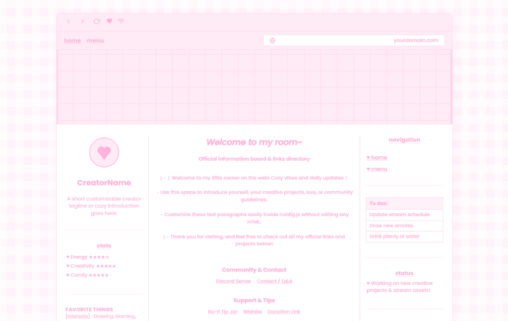

# Retro Pastel Profile Template



A cozy, retro faux-browser profile template for creators, streamers, and artists.

You can use this for your main link page, stream info board, commission sheet, or personal homepage. Everything is styled with soft pastel pinks, a clean gingham pattern, and retro browser UI accents.

If you use this template, please keep the small credit in the footer linking back to the project.

---

## What is Included

- **Faux browser header:** Retro window buttons, page tabs, and a clickable address bar that copies your URL to the clipboard.
- **Multi-column layout:** 
  - **Left sidebar:** Avatar, creator name, quick intro, stats box, favorite things, and stream/content schedule.
  - **Center area:** Welcome message, bio paragraphs, and organized link groups for socials, tips, streams, and portfolios.
  - **Right sidebar:** To-do list, status note, upcoming calendar events, and a secondary schedule.
- **Second page (Menu / Commissions):** A separate view for commission info, rules, and service categories with heart bullet lists.
- **No build setup required:** Plain HTML, CSS, and JavaScript. It runs immediately in any browser without installing packages or tools.

---

## How to Customize

You can customize this template in two simple ways:

### Option A: Use the Interactive Web Editor (Easiest ✨)
1. Open the [**Visual Template Editor**](editor.html) in your browser.
2. Click directly on any highlighted section on the canvas (avatar, bio, links, stats, schedules, commissions, top address bar) to edit in real time.
3. You can also duplicate sections, reorder them up/down, or add new widgets to any column.
4. Click **export config** at the top right, then **copy code** or **download `config.js`**.
5. Replace the `config.js` file in your repository and deploy!

### Option B: Edit `config.js` Directly in a Code Editor
All the text, links, headings, and images are configured inside [`config.js`](config.js). You do not need to edit `index.html` to update your details.

Open `config.js` in a text editor to update any section:

### 1. Site Title, Social Embed Card & Address Bar
Change your page title, social preview description, card image, accent color, and top address bar:
```javascript
meta: {
  title: "Your Name - Official Links",
  description: "A cozy retro profile and links directory.",
  socialImage: "assets/preview.png", // Image shown on Discord/Twitter/X embeds
  themeColor: "#FFB3D8",             // Mobile browser toolbar & embed accent color
  domainPill: "yourname.com",
  domainUrl: "https://yourname.com",
}
```

> [!TIP]
> **Social Preview Embeds (Discord, Twitter/X, iMessage):**
> Setting `description` and `socialImage` in `config.js` updates your metadata dynamically. Because some external platform scrapers (like Discord and Twitter) inspect static HTML before JavaScript runs, you can also update the `<meta>` tags in `<head>` inside [`index.html`](index.html) so link previews appear immediately when shared.

### 2. Header & Banner Image
Swap out the banner image with your own file in `assets/` or an image link:
```javascript
header: {
  navLinks: [
    { id: "home", label: "home" },
    { id: "menu", label: "menu" },
  ],
  bannerImage: {
    url: "assets/banner-placeholder.png",
    alt: "Banner",
    maxHeight: "180px",
  },
}
```

### 3. Profile & Left Sidebar
Edit your avatar, name, tagline, stats, and favorite things:
```javascript
leftColumn: {
  avatarUrl: "assets/avatar-placeholder.png",
  name: "Your Name",
  tagline: "Your cozy intro or tagline goes here.",
  statsButtonLabel: "stats",
  stats: [
    { label: "Energy", value: "★★★★☆" },
    { label: "Creativity", value: "★★★★★" },
  ],
  favoriteThings: {
    title: "FAVORITE THINGS",
    items: [
      { category: "Interests", value: "Drawing, Gaming, Music" },
    ],
  },
  varietySchedule: {
    title: "Main schedule",
    text: "Stream schedule details go here.",
  },
}
```

### 4. Welcome Message & Links (Center)
Add your greeting and group your links by category:
```javascript
centerColumn: {
  heading: "Welcome to my room~",
  subheading: "Official information board & links directory",
  paragraphs: [
    "Welcome to my corner of the web!",
    "Add any updates, lore, or community guidelines here.",
  ],
  linkGroups: [
    {
      title: "Social Media",
      links: [
        { label: "Twitter / X", url: "https://x.com/yourhandle" },
        { label: "Instagram", url: "https://instagram.com/yourhandle" },
      ],
    },
  ],
}
```

### 5. To-Dos, Status & Calendar (Right Sidebar)
Set your current status note, to-do list items, and upcoming dates:
```javascript
rightColumn: {
  todosTitle: "To dos:",
  todos: ["Update schedule", "Draw new emotes", "Drink water"],
  statusTitle: "status",
  statusText: "Working on new art and projects!",
  calendarTitle: "Calendar",
  calendarDate: "Next Event:",
  calendarEvent: "Community game night this Friday at 7pm EST.",
  sideScheduleTitle: "Side schedule",
  sideScheduleItems: [
    "Every Sunday weekly video release.",
  ],
}
```

### 6. Commissions & Menu Page
Update your commission availability, request form link, and service categories:
```javascript
menuSection: {
  leftColumn: {
    commissionsHeading: "Custom Commissions",
    commissionsStatus: "OPEN",
    commissionsDesc: "Custom commission requests are currently open.",
    commissionButton: { label: "Request Form", url: "https://forms.google.com/" },
    disclaimerTitle: "Notice & Policy",
    disclaimerText: "Important terms and guidelines for services.",
  },
  rightColumn: {
    title: "Service Catalog / Menu",
    description: "Browse available services and categories below.",
    categories: [
      {
        title: "Art & Emotes",
        items: ["Chibi Icon", "Twitch Emotes", "Character Art"],
      },
    ],
  },
}
```

### 7. Colors & Theme
If you want to change the color palette, open [`style.css`](style.css) and edit the variables at the top of the file:
```css
:root {
  --bg-page: #FFF2F8;        /* Background color behind the card */
  --bg-card: #FFFFFF;        /* Card background */
  --bg-header: #FFEBF5;      /* Header background */
  --border-main: #FFD4E9;    /* Border lines */
  --text-main: #FFB3D8;      /* Primary pink accent color */
}
```

---

## Free Hosting & Deployment

Because this is a static site with no build process, you can deploy it in less than a minute on free hosting services:

### Cloudflare Pages
1. Push your files to a GitHub repository.
2. Go to the Cloudflare dashboard, click **Workers & Pages** > **Create application** > **Pages** > **Connect to Git**.
3. Select your repository, leave the build command blank, set the output directory to `retro-pastel-profile` (or `/`), and click **Save and Deploy**.

### GitHub Pages
1. In your GitHub repository, go to **Settings** > **Pages**.
2. Under **Source**, choose `Deploy from a branch`, pick `main`, and save.

### Netlify / Vercel
- Drag and drop the folder directly into the Netlify or Vercel dashboard.

## Need Help with Customization?

If you want to make changes, add new features, or tweak layouts beyond your technical comfort zone:

* **Contact Me:** Feel free to check [notkoneko.space](https://notkoneko.space) for my links (Discord is preferred!).
* **Free AI / Coding Tools:** If it aligns with your workflow and morals, free tools like **Google Gemini** or **Antigravity IDE** can help you edit the code, generate new sections, or troubleshoot CSS.
* **Prefer Human Support?** If you avoid AI tools, send me a message directly via Discord and I'll be glad to help out.

---

## License

This template is open-source under the [MIT License](https://opensource.org/licenses/MIT). You are welcome to use and adapt it however you like.
